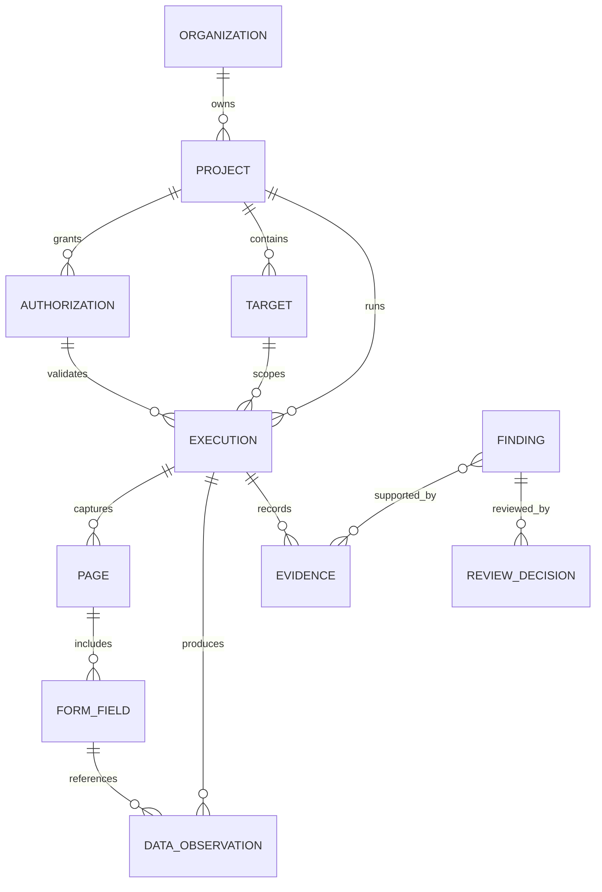

# Domain model - Etapa 2

## Principios

1. Una observacion no es un hallazgo.
2. Una evidencia puede respaldar multiples observaciones.
3. Un hallazgo puede relacionar multiples evidencias.
4. Toda evidencia pertenece a una ejecucion.
5. Toda ejecucion pertenece a un proyecto y referencia una autorizacion vigente.

## Diagrama conceptual

## Estados

- ExecutionState: DRAFT, VALIDATED, QUEUED, RUNNING, PAUSED, COMPLETED, COMPLETED_WITH_WARNINGS, FAILED, CANCELLED.
- ReviewState: PENDING, CONFIRMED, REJECTED, RECLASSIFIED.

## Cadena funcional minima

Organization -> Project -> Authorization -> Target -> Execution -> Page -> FormField -> DataObservation -> Evidence -> Finding -> ReviewDecision
